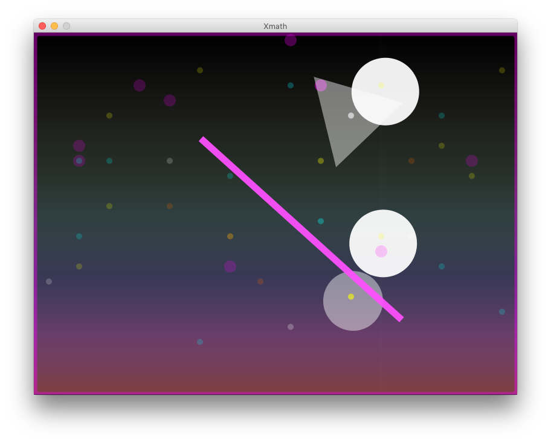

# xmath

<a href="https://www.google.com/doodles/oskar-fischingers-117th-birthday?hl=ja">Googleの「オスカーフィッシンガー生誕117年」ロゴ</a>を参考に,ProcessingとSonicPi3で制作しました。

Processingにはライブラリの「oscP5」が必要です。

最初に、SonicPi3には<a href="https://github.com/mathrax-s/xmath/blob/master/Xmath/sonicPi_code.pde">ココにあるコード</a>を記述し実行してください。

次にProcessingを実行します。

※SonicPi3を実行しないと音が出ません。
